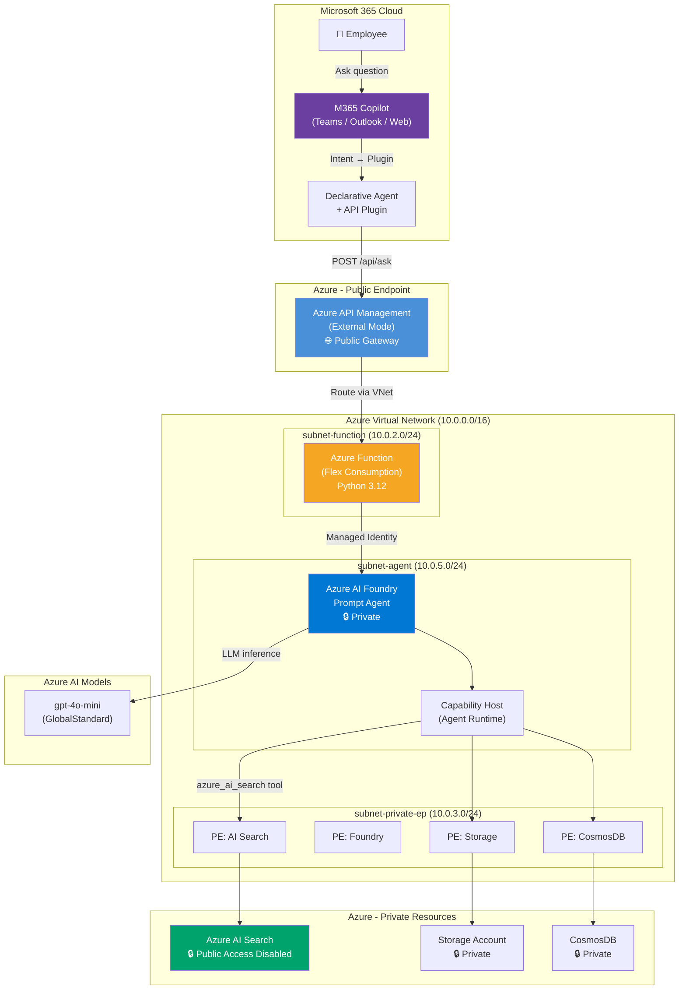
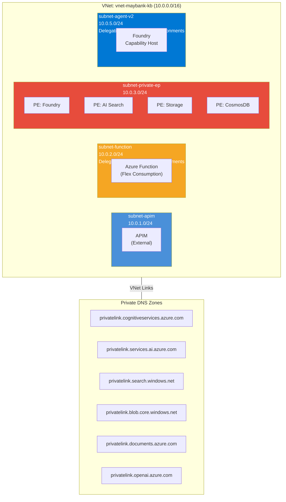
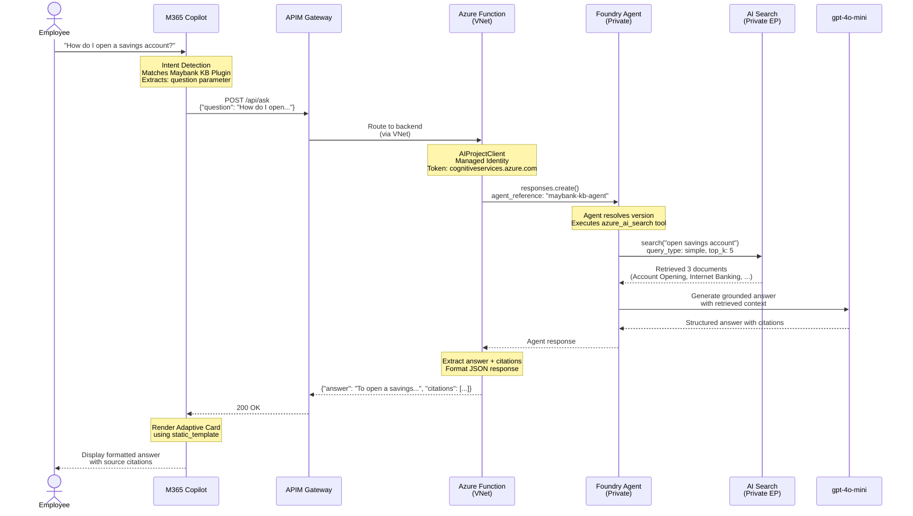
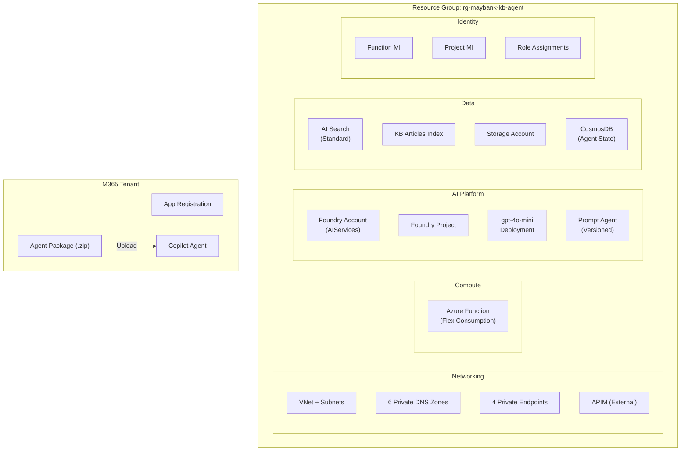
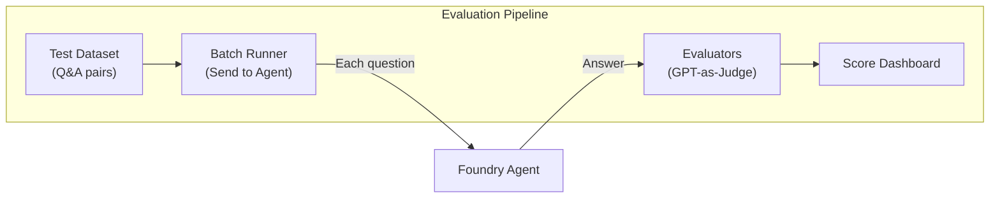

# M365 Declarative Agents with Azure AI Foundry
## Enterprise Architecture Pattern — Private Network Edition

> **Version**: 1.0 | **Date**: April 2026 | **Classification**: Customer-Facing  
> **Pattern**: RAG-based Knowledge Assistant via M365 Copilot + Azure AI Foundry

---

## 1. Executive Summary

This document describes a **validated architecture pattern** for building AI-powered knowledge assistants that run inside Microsoft 365 Copilot, backed by Azure AI Foundry and Azure AI Search — with a **private backend network** and controlled public ingress via API Management.

**What it enables:**
- Employees ask natural language questions inside M365 Copilot
- A custom Declarative Agent routes queries to Azure AI Foundry
- Foundry agent searches a private knowledge base (Azure AI Search)
- Grounded, cited answers are returned with source citations

**Key characteristics:**
- Private backend — all AI and data resources within VNet with private endpoints
- Controlled ingress — APIM gateway with rate limiting and request validation
- No custom UI — runs natively in M365 Copilot (Teams, Outlook, Web)
- Enterprise-grade — RBAC, Managed Identity, APIM gateway, zero secrets in code
- Evaluatable — built-in evaluation pipeline for answer quality

> **Note**: This is a validated technical architecture pattern. Production deployment for regulated industries (banking, financial services) requires additional security controls documented in Section 8 (Banking Security Controls). M365 Copilot ingress is managed by Microsoft and traverses public internet to the APIM gateway.

---

## 2. Pattern Applicability & Decision Criteria

### When to Use This Pattern

| Criteria | Fit |
|----------|-----|
| Curated knowledge retrieval (KB, FAQ, policies) | ✅ Best fit |
| Read-only Q&A with citations | ✅ Best fit |
| Private backend access required | ✅ Best fit |
| Single-turn question → answer flow | ✅ Best fit |
| Enterprise M365 deployment | ✅ Best fit |

### When NOT to Use This Pattern

| Criteria | Why Not |
|----------|---------|
| Rich interactive UX (forms, wizards, buttons) | API Plugin supports display-only Adaptive Cards |
| Long-running workflows (>15 seconds) | M365 Copilot timeout ~10-15s |
| Per-user data authorization (ACL-filtered results) | System identity pattern — no user-level search filtering |
| Multi-turn transactional workflows | Better suited for Bot Framework (Option A) |
| Real-time streaming responses | API Plugin returns complete JSON, no streaming |

### Option A vs Option B Decision Matrix

| Capability | Option A: Bot Framework | Option B: API Plugin (This Pattern) |
|-----------|------------------------|--------------------------------------|
| **UX Richness** | Full Adaptive Cards (interactive) | Display-only Adaptive Cards |
| **Interactive Forms** | ✅ Buttons, dropdowns, inputs | ❌ Not supported |
| **Implementation Complexity** | High (Bot SDK + Azure Bot Service) | Low (Azure Function + OpenAPI spec) |
| **Latency Tolerance** | Higher (async messaging) | Must respond within ~10-15s |
| **Private Networking** | Complex (Bot Service is SaaS) | ✅ Straightforward (Function in VNet) |
| **Multi-turn Conversations** | ✅ Native support | Limited (Copilot manages context) |
| **Deployment Overhead** | Bot Service + Channel Registration | Function App + API Plugin manifest |
| **Banking Suitability** | Better for transactional workflows | Better for knowledge retrieval |

**Recommendation**: Use **Option B (API Plugin)** for knowledge retrieval use cases. Use **Option A (Bot Framework)** when you need interactive forms or multi-turn transactions.

---

## 3. Architecture Overview

### High-Level Architecture



---

## 4. Component Details

### 4.1 M365 Declarative Agent

| Property | Value |
|----------|-------|
| **Manifest Schema** | v1.19 |
| **Agent Schema** | v1.6 |
| **Plugin Schema** | v2.2 |
| **Distribution** | M365 Admin Center → Copilot → Agents |

**Package Contents:**

| File | Purpose |
|------|---------|
| `manifest.json` | Teams app manifest — identity, permissions, valid domains |
| `declarativeAgent.json` | Agent name, instructions, conversation starters |
| `api-plugin.json` | Plugin functions, response templates, runtime binding |
| `openapi.json` | OpenAPI 3.0.1 spec — endpoint definitions, schemas |
| `color.png` / `outline.png` | App icons (192×192 / 32×32) |

**How Intent Works:**
1. User types a question in M365 Copilot
2. Copilot's orchestrator reads the `description_for_model` in `api-plugin.json`
3. If the question matches the plugin's domain, Copilot extracts parameters
4. Copilot calls the API endpoint defined in `openapi.json`
5. Response is rendered using the `static_template` (Adaptive Card)

> ⚠️ **Limitation**: Copilot controls intent detection. You influence it through description quality, not code.

### 4.2 Azure API Management (APIM)

| Property | Value |
|----------|-------|
| **SKU** | Developer (Production: Premium for zone redundancy) |
| **Mode** | External (public IP + VNet integration) |
| **Purpose** | Public gateway, rate limiting, request validation, auth enforcement |

> **Why External Mode?** M365 Copilot sends API calls from Microsoft's cloud over public internet. APIM must have a public endpoint to receive these calls. Internal mode would block Copilot traffic.

**Operations:**
| Method | Path | Backend |
|--------|------|---------|
| POST | `/api/ask` | Azure Function |
| POST | `/api/feedback` | Azure Function |
| GET | `/api/health` | Azure Function |

**Current Auth State vs Production:**

| Layer | Current (POC) | Production Recommendation |
|-------|--------------|--------------------------|
| APIM Ingress | Subscription key | OAuth 2.0 / JWT validation policy |
| APIM → Function | VNet routing (no key) | VNet routing + Function key |
| Plugin Auth | `auth: None` | `auth: OAuthPluginVault` with AAD |

> ⚠️ **Production Requirement**: For banking deployments, configure APIM with JWT validation policy to verify M365 tokens, IP allowlisting for Microsoft Copilot service IPs, and request/response schema validation.

### 4.3 Azure Function (API Backend)

| Property | Value |
|----------|-------|
| **Runtime** | Python 3.12 |
| **Plan** | Flex Consumption (VNet capable, no VM quota needed) |
| **Auth** | Anonymous (APIM is the gateway) |
| **Identity** | System-assigned Managed Identity |

**Role**: Bridge between M365 Copilot and Foundry Agent. Receives JSON from Copilot, calls Foundry via `AIProjectClient`, returns structured response.

### 4.4 Azure AI Foundry (Agent)

| Property | Value |
|----------|-------|
| **Agent Type** | Prompt (LLM-backed) |
| **Model** | gpt-4o-mini (GlobalStandard) |
| **Tool** | azure_ai_search |
| **Query Type** | Simple |
| **Network** | Private (VNet + Capability Host) |

**Agent Version**: Required for `agent_reference` API. The agent must be versioned (not just an assistant) for the Function to resolve it by name.

> ⚠️ **Data Residency Note**: GlobalStandard deployment routes requests to the nearest available region globally. For strict data residency requirements (e.g., BNM RMiT compliance), use **Standard** or **DataZoneStandard** deployment SKU to ensure data stays within a defined geographic boundary. This may affect model availability and cost.

### 4.5 Azure AI Search

| Property | Value |
|----------|-------|
| **SKU** | Standard |
| **Public Access** | Disabled |
| **Access** | Private endpoint only |
| **Index** | Knowledge base articles (structured documents) |

---

## 5. Network Architecture

### VNet Topology



### Private DNS Resolution

| Resource | DNS Zone | Resolves To |
|----------|----------|-------------|
| Foundry Account | `privatelink.cognitiveservices.azure.com` | Private IP in subnet-private-ep |
| Foundry Services | `privatelink.services.ai.azure.com` | Private IP in subnet-private-ep |
| AI Search | `privatelink.search.windows.net` | Private IP in subnet-private-ep |
| Storage | `privatelink.blob.core.windows.net` | Private IP in subnet-private-ep |
| CosmosDB | `privatelink.documents.azure.com` | Private IP in subnet-private-ep |

> ⚠️ **Critical**: All private DNS zones must be linked to the VNet. Misconfigured DNS = connectivity failure that looks like an authentication error.

---

## 6. Data Flow

### Request/Response Sequence



### Response Time Budget

| Hop | Typical Time | Notes |
|-----|-------------|-------|
| Copilot → APIM | ~200ms | Internet routing |
| APIM → Function | ~100ms | VNet internal |
| Function cold start | 0-3s | Warm-up timer mitigates |
| Function → Foundry | ~500ms | Token acquisition + routing |
| Foundry → AI Search | ~300ms | Private endpoint, simple query |
| Foundry → GPT (inference) | 2-4s | gpt-4o-mini, ~500 tokens |
| **Total** | **~4-8s** | Copilot timeout: ~10-15s |

---

## 7. Identity, Authorization & Trust Boundaries

### Authentication at Each Hop

```mermaid
flowchart LR
    subgraph "Trust Boundary 1: Internet"
        User["👤 User<br/>(M365 Auth)"]
        Copilot["M365 Copilot<br/>(Microsoft-managed)"]
    end
    
    subgraph "Trust Boundary 2: APIM Gateway"
        APIM["APIM<br/>(Subscription Key /<br/>OAuth optional)"]
    end
    
    subgraph "Trust Boundary 3: VNet (Private)"
        Func["Function<br/>(Managed Identity)"]
        Foundry["Foundry<br/>(RBAC: AI Developer)"]
        Search["AI Search<br/>(RBAC: Index Reader)"]
    end
    
    User -->|"M365 SSO"| Copilot
    Copilot -->|"API Call<br/>(auth: None*)"| APIM
    APIM -->|"VNet routing"| Func
    Func -->|"Managed Identity<br/>cognitiveservices.azure.com"| Foundry
    Foundry -->|"Managed Identity<br/>RBAC: Search Index Reader"| Search
    
    style User fill:#6B3FA0,color:#fff
    style APIM fill:#4A90D9,color:#fff
    style Func fill:#F5A623,color:#fff
    style Foundry fill:#0078D4,color:#fff
    style Search fill:#00A36C,color:#fff
```



### RBAC Role Assignments

| Principal | Resource | Role | Purpose |
|-----------|----------|------|---------|
| Function MI | Foundry Account | Azure AI Developer | Agent invocation |
| Function MI | Foundry Account | Cognitive Services User | Token acquisition |
| Function MI | Foundry Project | Azure AI Developer | Project-level access |
| Project MI | AI Search | Search Index Data Reader | Read search results |
| Project MI | AI Search | Search Service Contributor | Manage connections |

### ⚠️ Important: System Identity Pattern

This architecture uses a **system-authorized** model, not per-user authorization:

- The **Function's Managed Identity** accesses Foundry on behalf of all users
- The **Foundry Project's Identity** accesses AI Search on behalf of all queries
- **End-user identity is NOT propagated** to the backend

**Implication**: All users see the same search results. If the knowledge base contains role-restricted content, you must implement additional authorization logic (e.g., security trimming in AI Search, user-context filtering in the Function).

---

## 8. Security Architecture

### Defense in Depth

| Layer | Control | Implementation |
|-------|---------|----------------|
| **Network** | VNet isolation | All backend resources in private subnets |
| **Network** | Private endpoints | No public access to Search, Foundry, Storage |
| **Network** | NSG rules | Subnet-level network security groups |
| **Gateway** | APIM | Rate limiting, request validation, IP filtering |
| **Identity** | Managed Identity | No secrets in code or configuration |
| **Identity** | RBAC | Least-privilege role assignments |
| **Data** | Encryption at rest | Azure-managed keys (default) |
| **Data** | Encryption in transit | TLS 1.2+ on all connections |
| **AI Safety** | Content filtering | Azure AI content safety on gpt-4o-mini |
| **AI Safety** | Grounding | Agent instructions constrain scope |
| **Monitoring** | Audit logs | Azure Activity Log + Diagnostic Settings |

### NIST AI RMF 1.0 Mapping

| NIST Function | Control Area | Implementation |
|--------------|-------------|----------------|
| **GOVERN** | Accountability | Agent instructions define scope; RBAC controls who can modify |
| **MAP** | Risk identification | Prompt injection mitigated by agent instructions; data leakage prevented by VNet |
| **MEASURE** | Risk assessment | Evaluation pipeline measures groundedness, relevance, similarity |
| **MANAGE** | Risk mitigation | Private endpoints, APIM rate limiting, content filtering |

### Secrets Management

| Secret Type | How Managed | Where Stored |
|-------------|------------|--------------|
| Azure credentials | Managed Identity | No secret exists |
| AI Search access | AAD connection (MI) | Foundry connection config |
| APIM subscription key | Auto-generated | APIM configuration |
| Storage access | Managed Identity | No secret exists |

> ✅ **Zero secrets in code or environment variables** — all authentication uses Managed Identity.

### Banking Security Controls (Production)

The following controls are recommended for regulated financial services deployments:

**Prompt & Response Data Handling:**

| Control | Recommendation |
|---------|---------------|
| Prompt/response logging | Log metadata (timestamps, token counts) but **redact PII** from prompt/response bodies |
| Log retention | Align with bank's data retention policy (typically 7 years for financial services) |
| PII detection | Enable Azure AI Content Safety PII detection on prompts before sending to model |
| Data classification | Tag all AI-related logs and storage as "Confidential" per bank's classification scheme |

**Threat Mitigations:**

| Threat | Mitigation |
|--------|-----------|
| Prompt injection | Agent instructions constrain scope; APIM request schema validation; Content Safety filters |
| Data exfiltration via prompts | VNet isolation prevents outbound data flow; agent only accesses approved KB index |
| Model output leakage | Grounding ensures answers come from KB only; monitor for off-topic responses |
| Unauthorized API access | APIM JWT validation + IP allowlisting for M365 service IPs |
| Insider threat | RBAC least-privilege; separate provisioning roles from runtime roles; audit all changes |

**Encryption & Key Management:**

| Area | Default | Banking Recommendation |
|------|---------|----------------------|
| Encryption at rest | Azure-managed keys (AES-256) | Consider **Customer-Managed Keys (CMK)** via Key Vault for Search, Storage, CosmosDB |
| Encryption in transit | TLS 1.2 | Enforce TLS 1.2 minimum; disable older protocols |
| Key rotation | Managed by Azure | For CMK: automate rotation via Key Vault policy |

**Security Monitoring & SIEM:**

| Component | Integration |
|-----------|-------------|
| Azure Activity Log | Forward to **Microsoft Sentinel** or bank's SIEM |
| APIM diagnostic logs | Stream to Log Analytics; alert on anomalous patterns |
| AI Search audit logs | Track query patterns, index modifications |
| Foundry agent traces | Application Insights with data sampling/redaction |
| Microsoft Defender for Cloud | Enable for all resources; review Secure Score |

**RBAC Separation of Duties:**

| Role | Provisioning Phase | Runtime Phase |
|------|-------------------|---------------|
| Deployer | Contributor, User Access Admin | Remove after deployment |
| Function MI | — | Azure AI Developer, Cognitive Services User |
| Project MI | — | Search Index Data Reader (not Contributor at runtime) |
| Security Admin | RBAC management | Audit log reviewer |

---

## 9. Deployment Architecture

### Resource Deployment Overview



### Deployment Sequence

| Step | Action | Tool | Duration |
|------|--------|------|----------|
| 1 | Create VNet + Subnets | Azure CLI | ~2 min |
| 2 | Create Private DNS Zones + VNet Links | Azure CLI | ~3 min |
| 3 | Deploy Foundry (Bicep template) | ARM Deployment | ~15-20 min |
| 4 | Create AI Search + Index | Azure CLI + REST | ~5 min |
| 5 | Create Private Endpoints | Azure CLI | ~3 min |
| 6 | Deploy APIM (Developer tier) | Azure CLI | ~30-45 min |
| 7 | Deploy Function App (Flex Consumption) | Azure CLI + func CLI | ~5 min |
| 8 | Configure RBAC + Connections | Azure CLI | ~5 min |
| 9 | Create Agent + Version | REST API | ~2 min |
| 10 | Configure APIM Operations | Azure CLI | ~3 min |
| 11 | Build + Upload M365 Package | Manual | ~5 min |
| **Total** | | | **~80-100 min** |

> ⚠️ **Bootstrap Note**: Foundry account requires temporary public access for initial agent creation via REST API. Lock down to private after setup.

---

## 10. Evaluation & Monitoring

### Evaluation Architecture



### Evaluation Metrics

| Evaluator | What It Measures | Target Score |
|-----------|-----------------|-------------|
| **Groundedness** | Is the answer supported by retrieved documents? | ≥ 4.0/5.0 |
| **Relevance** | Does the answer address the question? | ≥ 4.0/5.0 |
| **Coherence** | Is the answer well-structured? | ≥ 4.0/5.0 |
| **Similarity** | How close to expected answer? | ≥ 3.5/5.0 |
| **F1 Score** | Token overlap with ground truth | ≥ 0.6 |

### Monitoring Stack

| Signal | Tool | What to Watch |
|--------|------|---------------|
| API latency & errors | APIM Analytics | P95 latency, 5xx rate |
| Function execution | Application Insights | Cold starts, exceptions |
| Agent performance | Foundry Evaluation | Groundedness drift |
| Search quality | AI Search Metrics | Query latency, zero-result rate |
| Security events | Azure Monitor | Failed auth, unusual patterns |

---

## 11. Resiliency & Failure Modes

### Single-Region Architecture (Current)

| Component | Failure Impact | Mitigation |
|-----------|---------------|------------|
| **APIM down** | No requests reach backend | APIM zone redundancy (Premium) |
| **Function down** | Copilot gets 502/timeout | Flex Consumption auto-scales; warm-up timer |
| **Foundry down** | Agent queries fail | Retry logic in Function; alert on failures |
| **AI Search down** | No search results | Search replicas (Standard: up to 12) |
| **Private DNS failure** | All private connections break | Monitor DNS resolution; alert on failures |
| **Model throttling** | Slow/failed responses | Capacity planning; request retry with backoff |

### Recommendations for Production

| Area | Recommendation |
|------|---------------|
| **APIM** | Premium SKU with zone redundancy; multi-region for DR |
| **Function** | Always-ready instances to avoid cold starts |
| **AI Search** | 2+ replicas for HA; geo-replicated index for DR |
| **Foundry** | Monitor capacity; set up alerts for agent failures |
| **Backup** | Regular AI Search index snapshots; IaC (Bicep) for rebuild |
| **RTO/RPO** | RTO: ~30 min (redeploy from IaC); RPO: depends on index freshness |

---

## 12. Cost & Sizing Considerations

### Baseline Infrastructure Estimate

> **Assumptions**: Single region, ~500 queries/day, avg 1000 tokens/query, single Search replica.  
> **Excludes**: M365 Copilot licensing, Log Analytics/App Insights retention, security tooling (Sentinel, Defender), CMK Key Vault, DR/multi-region.

| Resource | SKU/Tier | Monthly Estimate (USD) | Notes |
|----------|----------|----------------------|-------|
| **APIM** | Developer | ~$50 | Production: Premium ~$2,800 |
| **Function** | Flex Consumption | ~$5-50 | Pay-per-execution |
| **Foundry** | AIServices | Included | Pay for model usage |
| **gpt-4o-mini** | GlobalStandard | ~$20-200 | Based on token volume |
| **AI Search** | Standard (1 replica) | ~$250 | +$250 per additional replica |
| **Storage** | Standard | ~$5 | Agent state |
| **CosmosDB** | Serverless | ~$5-25 | Agent thread storage |
| **VNet + PE** | - | ~$10-30 | Per private endpoint |
| **Private DNS** | - | ~$3-5 | Per hosted zone |
| **Total (Dev/POC)** | | **~$350-600/mo** | |
| **Total (Prod baseline)** | | **~$3,500-4,000/mo** | With Premium APIM |

### Additional Production Costs (Not Included Above)

| Item | Estimated Cost | Notes |
|------|---------------|-------|
| M365 Copilot License | ~$30/user/month | Required for each end user |
| Log Analytics / App Insights | ~$50-500/mo | Depends on retention and volume |
| Microsoft Sentinel | ~$100-500/mo | SIEM for security monitoring |
| Microsoft Defender for Cloud | ~$15/server/mo | Per protected resource |
| Key Vault (CMK) | ~$5-20/mo | If using customer-managed keys |
| AI Search HA (2+ replicas) | +$250-500/mo | For 99.9% SLA |
| Multi-region DR | 2x infrastructure | Full duplicate in secondary region |

### Scaling Factors
- **Token volume**: Primary cost driver — more questions = more gpt-4o-mini tokens
- **Search replicas**: Add replicas for query throughput and HA (2 replicas for 99.9% SLA)
- **Function concurrency**: Flex Consumption scales automatically
- **APIM tier**: Developer for POC; Premium for production zone redundancy

---

## 13. Assumptions, Constraints & Non-Goals

### Assumptions

| # | Assumption |
|---|-----------|
| 1 | Knowledge base content is curated and pre-indexed in Azure AI Search |
| 2 | All users have M365 Copilot licenses |
| 3 | Single Azure region deployment is acceptable for initial rollout |
| 4 | Knowledge base content is not user-specific (same content for all users) |
| 5 | Responses under 10 seconds are acceptable for user experience |
| 6 | Azure AI Foundry capability host is available in the target region |
| 7 | GlobalStandard model deployment is acceptable; if strict data residency is required, switch to Standard or DataZoneStandard SKU |
| 8 | M365 Copilot to APIM traffic traverses public internet (Microsoft-managed) |

### Constraints

| # | Constraint |
|---|-----------|
| 1 | M365 Copilot API Plugin timeout: ~10-15 seconds |
| 2 | No interactive Adaptive Card elements (display-only) |
| 3 | System identity — no per-user search authorization |
| 4 | Agent creation requires temporary public access to Foundry |
| 5 | Capability host subnet must be exclusively delegated |

### Non-Goals

| # | Non-Goal |
|---|---------|
| 1 | Multi-region active-active deployment |
| 2 | Per-user search ACLs / security trimming |
| 3 | Real-time document ingestion pipeline |
| 4 | Interactive form-based workflows |
| 5 | Custom UI outside M365 Copilot |

---

## 14. Platform Constraints & Design Decisions

### Design Decisions

| # | Learning | Impact |
|---|---------|--------|
| 1 | **Private Foundry solves the PE+Agent issue** | When Foundry runs in shared infrastructure, adding a PE to AI Search breaks the agent's search tool (DNS resolution conflict). Deploying Foundry inside the VNet with a capability host resolves this. |
| 2 | **Agent versions are mandatory for agent_reference** | The `responses.create()` API with `agent_reference` requires a published agent version, not just an assistant definition. |
| 3 | **Flex Consumption avoids VM quota** | Traditional VNet integration requires VM quota. Flex Consumption uses `Microsoft.App/environments` delegation — no VMs needed. |
| 4 | **Temporary public access for bootstrap** | Private Foundry requires temporary public network access to create agents via REST API from a dev machine. Lock down immediately after. |
| 5 | **No interactive Adaptive Cards** | API Plugin `static_template` supports display-only cards. Buttons, inputs, and Action.Submit are not supported. Use Bot Framework (Option A) for interactive UX. |
| 6 | **Copilot timeout is ~10-15 seconds** | Function warm-up timer trigger reduces cold start impact. Keep total response under 10s. |
| 7 | **Token scope matters** | Manual token with `ai.azure.com` scope fails for SDK calls. Use `AIProjectClient.get_openai_client()` which uses `cognitiveservices.azure.com` scope internally. |
| 8 | **Connection auth: AAD over ApiKey** | AAD connections with workspace managed identity are more secure and avoid key rotation. |

### Known Limitations

| Limitation | Workaround |
|-----------|-----------|
| No per-user search filtering | Implement security trimming in Function or Search |
| Single-region only | Multi-region requires duplicating Foundry + Search |
| Agent creation requires public access | Bootstrap-only; document as operational procedure |
| Copilot intent detection is opaque | Improve plugin descriptions; test with varied queries |
| No streaming in API Plugin | Bot Framework (Option A) for streaming |

---

## 15. Prerequisites & Getting Started

### Azure Requirements

| Requirement | Details |
|-------------|---------|
| Azure Subscription | With sufficient quota for AI Services + Search |
| Region | East US (or region with Foundry capability host support) |
| Azure CLI | v2.60+ |
| Azure Functions Core Tools | v4.x |
| Python | 3.12 |

### M365 Requirements

| Requirement | Details |
|-------------|---------|
| M365 E3/E5 License | With Copilot license |
| Admin Access | M365 Admin Center → Copilot → Agents |
| App Registration | Azure AD app for OAuth (optional) |

### RBAC Permissions Needed

| Who | Needs | On |
|-----|-------|----|
| Deployer | Contributor + User Access Admin | Resource Group |
| Deployer | Cognitive Services Contributor | Foundry Account |
| Deployer | Search Service Contributor | AI Search |
| M365 Admin | Teams App Upload | M365 Admin Center |

---

## 16. File Structure Reference

```
maybank-kb-agent/
├── function_app/
│   ├── function_app.py          # Azure Function — API backend
│   ├── requirements.txt         # Python dependencies
│   └── host.json                # Function host config
├── m365-app/
│   └── appPackage/
│       ├── manifest.json        # Teams app manifest (v1.19)
│       ├── declarativeAgent.json # Agent definition (v1.6)
│       ├── api-plugin.json      # Plugin schema (v2.2)
│       ├── openapi.json         # OpenAPI 3.0.1 spec
│       ├── color.png            # App icon (192x192)
│       └── outline.png          # Outline icon (32x32)
├── infra/
│   └── private-network/
│       ├── azuredeploy.json     # Bicep template (Foundry + VNet)
│       └── deploy.parameters.json # Deployment parameters
├── src/
│   └── agent.py                 # Agent CRUD operations
├── data/
│   └── kb_articles.json         # Sample KB data
└── docs/
    └── M365-Agents-Azure-Foundry-Architecture.md  # This document
```

---

## Appendix A: Glossary

| Term | Definition |
|------|-----------|
| **Declarative Agent** | A custom M365 Copilot agent defined via JSON manifests (no code in Copilot) |
| **API Plugin** | OpenAPI-based integration that Copilot calls as a tool |
| **Prompt Agent** | Foundry agent backed by an LLM model (vs. hosted/container agent) |
| **Capability Host** | Foundry's VNet-integrated runtime for agent execution |
| **Agent Version** | Published snapshot of an agent definition (required for agent_reference) |
| **Private Endpoint** | Network interface that brings an Azure service into your VNet |
| **Managed Identity** | Azure-managed credential (no secrets) for service-to-service auth |
| **Flex Consumption** | Azure Function hosting plan with VNet support and no VM requirement |
| **Adaptive Card** | JSON-based card format for rendering rich content in Teams/Copilot |
| **RAG** | Retrieval-Augmented Generation — LLM grounded on retrieved documents |

---

## Appendix B: Compliance Considerations

### Data Residency
- Backend resources (AI Search, Storage, CosmosDB) remain in the selected Azure region
- **Model inference**: GlobalStandard deployment may route to any Azure region globally. For strict residency, use **Standard** or **DataZoneStandard** SKU
- M365 Copilot processes prompts within Microsoft's M365 boundary
- No cross-region data transfer for storage and search (single-region deployment)

### Audit & Logging
- Azure Activity Log captures all control plane operations
- APIM provides API-level request/response logging
- Foundry agent traces available via Application Insights
- Search diagnostic logs track query patterns and performance

### Regulatory Mapping (Banking)

| Control Area | Requirement | Implementation |
|-------------|------------|----------------|
| Data encryption | At rest + in transit | Azure-managed encryption + TLS 1.2 |
| Access control | Least privilege | RBAC + Managed Identity |
| Network security | Private network | VNet + Private Endpoints |
| Audit trail | All operations logged | Activity Log + Diagnostic Settings |
| Data sovereignty | Data stays in region | Single-region deployment |
| AI governance | Model output controls | Content filtering + grounding |

---

*Document generated from a working implementation. All architecture decisions validated through real deployment and testing.*
